* Table of Contents
{:toc}

--------------------------------------------------------------------------------------------------------------------

## **Acknowledgements**

*  Project template and structure, AddressBook Level 3 from [SE-EDU](https://github.com/se-edu/addressbook-level3).
*  Reuse of code: URL encoding from [2ality](https://2ality.com/2010/12/simple-way-of-sending-emails-in-java.html).

--------------------------------------------------------------------------------------------------------------------

## **Setting up, getting started**

Refer to the guide [_Setting up and getting started_](SettingUp.md).

--------------------------------------------------------------------------------------------------------------------

## **Design**

:bulb: **Tip 1:** The `.puml` files used to create diagrams in this document can be found in the [diagrams](https://github.com/se-edu/addressbook-level3/tree/master/docs/diagrams/) folder. Refer to the [_PlantUML Tutorial_ at se-edu/guides](https://se-education.org/guides/tutorials/plantUml.html) to learn how to create and edit diagrams.

:bulb: **Tip 2:** Each of the following class, sequence and activity diagram can be enlarged by CLICKING on the respective
images!

### Architecture

The ***Architecture Diagram*** given above explains the high-level design of the App.

Given below is a quick overview of main components and how they interact with each other.

**Main components of the architecture**

**`Main`** has two classes called [`Main`](https://github.com/AY2122S1-CS2103-T14-3/tp/blob/master/src/main/java/seedu/mycrm/Main.java) and [`MainApp`](https://github.com/AY2122S1-CS2103-T14-3/tp/blob/master/src/main/java/seedu/mycrm/MainApp.java). It is responsible for,
* At app launch: Initializes the components in the correct sequence, and connects them up with each other.
* At shut down: Shuts down the components and invokes cleanup methods where necessary.

[**`Commons`**](#common-classes) represents a collection of classes used by multiple other components.

The rest of the App consists of four components.

* [**`UI`**](#ui-component): The UI of the App.
* [**`Logic`**](#logic-component): The command executor.
* [**`Model`**](#model-component): Holds the data of the App in memory.
* [**`Storage`**](#storage-component): Reads data from, and writes data to, the hard disk.

**How the architecture components interact with each other**

The *Sequence Diagram* below shows how the components interact with each other for the scenario where the user issues the command `delete 1`.

Each of the four main components (also shown in the diagram above),

* defines its *API* in an `interface` with the same name as the Component.
* implements its functionality using a concrete `{Component Name}Manager` class (which follows the corresponding API `interface` mentioned in the previous point.

For example, the `Logic` component defines its API in the `Logic.java` interface and implements its functionality using the `LogicManager.java` class which follows the `Logic` interface. Other components interact with a given component through its interface rather than the concrete class (reason: to prevent outside component's being coupled to the implementation of a component), as illustrated in the (partial) class diagram below.

The sections below give more details of each component.

### UI component

The **API** of this component is specified in [`Ui.java`](https://github.com/AY2122S1-CS2103-T14-3/tp/blob/master/src/main/java/seedu/mycrm/ui/Ui.java)

The UI consists of a `MainWindow` that is made up of parts e.g.`CommandBox`, `ResultDisplay`, `MainDisplay`,
`StatusBarFooter` etc. All these, including the `MainWindow`, inherit from the abstract `UiPart` class which captures
the commonalities between classes that represent parts of the visible GUI.

The `UI` component uses the JavaFx UI framework. The layout of these UI parts are defined in matching `.fxml` files that
are in the `src/main/resources/view` folder. For example, the layout of the
[`MainWindow`](https://github.com/AY2122S1-CS2103-T14-3/tp/blob/master/src/main/java/seedu/mycrm/ui/MainWindow.java)
is specified in [`MainWindow.fxml`](https://github.com/AY2122S1-CS2103-T14-3/tp/blob/master/src/main/resources/view/MainWindow.fxml)

The `UI` component,

* executes user commands using the `Logic` component.
* listens for changes to `Model` data so that the UI can be updated with the modified data.
* keeps a reference to the `Logic` component, because the `UI` relies on the `Logic` to execute commands.
* depends on some classes in the `Model` component, as it displays `Job`, `Mail`, `Contact`, `Product`, `Template`, `History`
  objects residing in the `Model`.

### Logic component

**API** : [`Logic.java`](https://github.com/AY2122S1-CS2103-T14-3/tp/blob/master/src/main/java/seedu/mycrm/logic/Logic.java)

Here's a (partial) class diagram of the `Logic` component:

[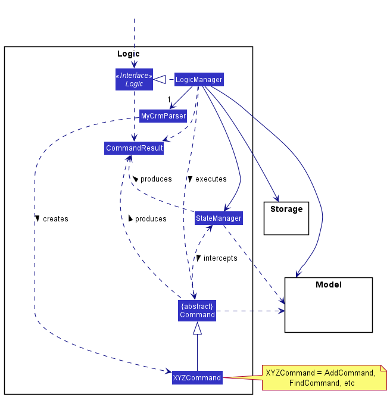](https://ay2122s1-cs2103-t14-3.github.io/tp/images/LogicClassDiagram.png)

How the `Logic` component works:
1. When `Logic` is called upon to execute a command, it uses the `MyCRMParser` class to parse the user command.
2. This results in a `Command` object (more precisely, an object of one of its subclasses e.g., `AddCommand`) which is executed by the `LogicManager`.
3. `StateManager` checks to see whether the parsed command can currently be executed depending on the current state of the application.
   If it can the `Command` object is executed by the `LogicManager`.
4. The command can communicate with the `Model` when it is executed (e.g. to add a person).
5. The result of the command execution is encapsulated as a `CommandResult` object.
6. For certain commands `StateManager` intercepts this `CommandResult` object. It communicates with model to perform extra operations and modifies the
   `CommandResult` accordingly.
7. The `CommandResult` object is returned from `Logic`.

The Sequence Diagram below illustrates the interactions within the `Logic` component for the `execute("addJob c/1 p/1 d/Fix...")` API call.

Please refer to [StateManager](#statemanager) for a more detailed explanation on its motivation and implementation.

Here are the other classes in `Logic` (omitted from the class diagram above) that are used for parsing a user command:

How the parsing works:
* When called upon to parse a user command, the `MyCrmParser` class creates an `XYZCommandParser` (`XYZ` is a placeholder for the specific command name e.g., `AddCommandParser`) which uses the other classes shown above to parse the user command and create a `XYZCommand` object (e.g., `AddCommand`) which the `MyCrmParser` returns back as a `Command` object.
* All `XYZCommandParser` classes (e.g., `AddCommandParser`, `DeleteCommandParser`, ...) inherit from the `Parser` interface so that they can be treated similarly where possible e.g, during testing.

### Model component
**API** : [`Model.java`](https://github.com/se-edu/addressbook-level3/tree/master/src/main/java/seedu/address/model/Model.java)

The `Model` component,

* stores the MyCrm data i.e:
  * all `Contact` objects (which are contained in a `UniqueContactList` object).
  * all `Product` objects (which are contained in a `UniqueProductList` object).
  * all `Template` objects (which are contained in a `UniqueTemplateList` object).
  * all `Job` objects (which are contained in a `UniqueJobList` object).
  * all `Mail` objects (which are contained in a `UniqueMailList` object).
* stores the currently 'selected' `Contact`, `Product`, `Template`,`Job`and `Mail` objects (e.g., results of a 
  search query)  as a separate _filtered_ list which is exposed to outsiders as an unmodifiable 
  `ObservableList<Contact>` that can be 'observed' e.g. the UI can be bound to this list so that the UI 
  automatically updates when the data in the list change. 
* stores a `UserPref` object that represents the user’s preferences. This is exposed to the outside as a `ReadOnlyUserPref` objects.
* does not depend on any of the other three components (as the `Model` represents data entities of the domain, they should make sense on their own without depending on other components)

### Storage component

**API** : [`Storage.java`](https://github.com/se-edu/addressbook-level3/tree/master/src/main/java/seedu/address/storage/Storage.java)

The `Storage` component,
* can save both MyCrm data and user preference data in json format, and read them back into corresponding objects.
* inherits from both `MyCrmStorage` and `UserPrefStorage`, which means it can be treated as either one (if only the functionality of only one is needed).
* depends on some classes in the `Model` component (because the `Storage` component's job is to save/retrieve objects that belong to the `Model`)

### Common classes

Classes used by multiple components are in the `seedu.mycrm.commons` package.

--------------------------------------------------------------------------------------------------------------------

## **Implementation**

This section describes some noteworthy details on how certain features are implemented.

* [Adding a contact](#adding-a-contact)
* [Editing a contact](#editing-a-contact)
* [Deleting a contact](#deleting-a-contact)
* [Finding a contact](#finding-a-contact)
* [Hiding a contact](#hiding-a-contact)
* [Undoing Hiding a contact](#undoing-hiding-a-contact)
* [Listing contacts](#listing-contacts)
* [Adding a template](#adding-a-template)
* [Editing a template](#editing-a-template)
* [Deleting a template](#deleting-a-template)
* [Finding a template](#finding-a-template)
* [Constructing an email](#constructing-an-email)
* [Adding a product](#adding-a-product)
* [Editing a product](#editing-a-product)
* [StateManager](#statemanager)
* [Adding a job](#adding-a-job)
* [Editing a job](#editing-a-job)
* [Printing a monthly job report](#printing-a-monthly-job-report)

### Adding a Contact

#### Implementation

The **Adding a Contact** mechanism is facilitated by `MyCRM`. This Contact created is stored internally using
`UniqueContactList` inside the `MyCrm` object.  
Additionally, `addContact` allows to have only partially info of a client with consideration of privacy. Commands
such as `AddContact n/xxx e/xxx` `addContact n/xxx c/xxx` are all acceptable.

#### Usage

The activity diagram below illustrates how the events of `addContact` command behave when executed by a user:

[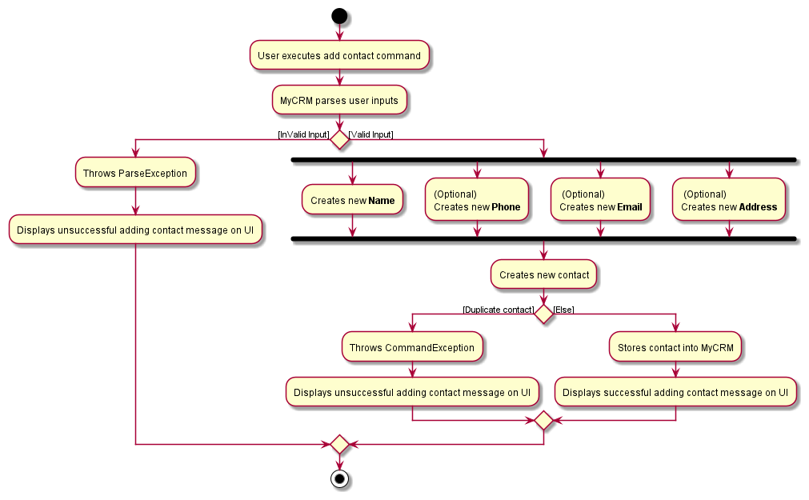](https://ay2122s1-cs2103-t14-3.github.io/tp/images/contact/AddContactActivityDiagram.png)

Given below is an example usage scenario and how the **Adding a Contact** mechanism behaves at each step.

[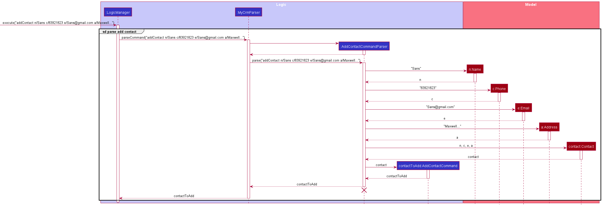](https://ay2122s1-cs2103-t14-3.github.io/tp/images/contact/AddContactParseSequenceDiagram.png)

Within `AddContactCommandParser#parse`, `ParserUtil#parseName` will be called to create a name using
"Sans", `ParserUtil#parsePhone` to create a phone using "83921823", `ParserUtil#parseEmail` to
create an email using "Sans@gmail.com", `ParserUtil#parseAddress` to create an address using "Maxwell...".  
Then create a contact using the new name, phone, email and address.

Note that `Phone`, `Email`, `Address`, are optional, but at least one of these 3 fields
must exist.

[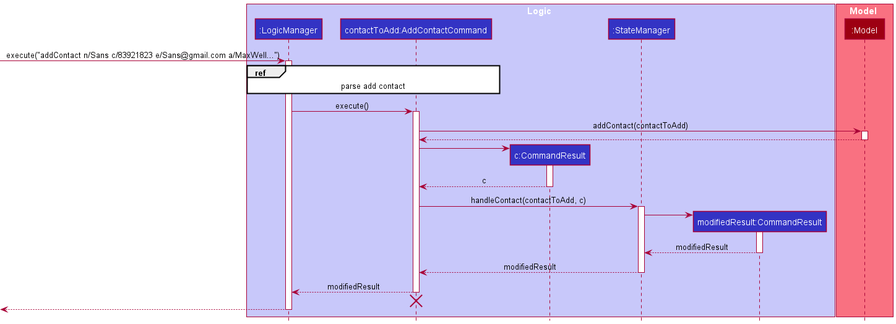](https://ay2122s1-cs2103-t14-3.github.io/tp/images/contact/AddContactSequenceDiagram.png)

Note: Please refer to [StateManager](#statemanager) for more details on why the command result of the AddContactCommand is intercepted.

### Editing a Contact

#### Implementation

The **Editing a Contact** mechanism is facilitated by `MyCRM`. This mechanism reads and modifies a target contact
object from `UniqueContactList` inside the `MyCRM` object.

#### Usage

The activity diagram below illustrates how the events of `editContact` command behave when executed by a user:

Given below is an example usage scenario and how the **Editing a Contact** mechanism behaves at each step.

Within `EditContactCommandParser#parse`,
- `Index` must be is valid (within the range of contactList).
- `EditContactDescriptor` will only get the values of `Name`, `Phone`, `Email`, `Address`, and `Tags`
if their respective prefixes are present.
- `isHidden` is will not be handled by `EditContactDescrptior`, it will be updated in `createEditedContact`.

`EditContactCommandParser#parse` will call `ArgumentMultimap#getPreamble` to get the target contact's index and
`ArgumentMultimap#getValue` to extract `Name`, `Phone`, `Email`, `Address`: "Frisks", "88888888", "Frisks@gmail.com"
and "Jurong West" from the command string respectively.

### Deleting a Contact

#### Implementation

The **Deleting a Contact** mechanism is facilitated by `MyCRM`. This mechanism reads and deletes a target contact
object from `UniqueContactList` inside the `MyCRM` object.

#### Usage

The activity diagram below illustrates how the events of `deleteContact` command behave when executed by a user:

[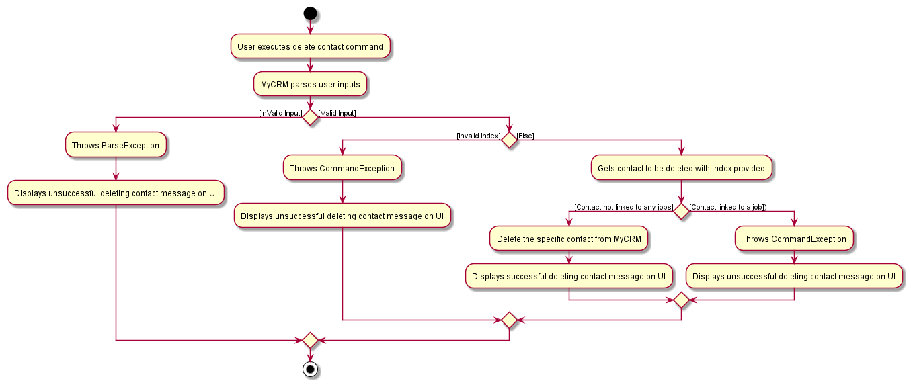](https://ay2122s1-cs2103-t14-3.github.io/tp/images/contact/DeleteContactActivityDiagram.png)

Given below is an example usage scenario and how the **Deleting a Contact** mechanism behaves at each step.

Within `DeleteContactCommandParser#parse`,
- `Index` must be is valid (within the range of contactList).
- The contact specified to be deleted must have no jobs linked, otherwise error message will be displayed in UI panel.

`DeleteContactCommandParser#parse` will call `ParserUtil#parseIndex` to get the target contact's index to delete it.

[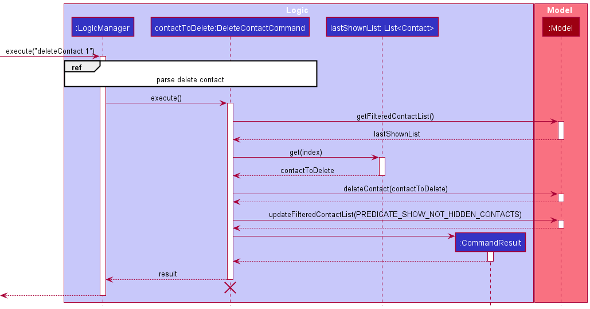](https://ay2122s1-cs2103-t14-3.github.io/tp/images/contact/DeleteContactSequenceDiagram.png)

### Finding a Contact

#### Implementation

The **Finding a Contact** mechanism is facilitated by `MyCRM`. This mechanism finds specific list of contact
object from `UniqueContactList` inside the `MyCRM` object with certain keywords provided.

#### Usage

The activity diagram below illustrates how the events of `findContact` command behave when executed by a user:

[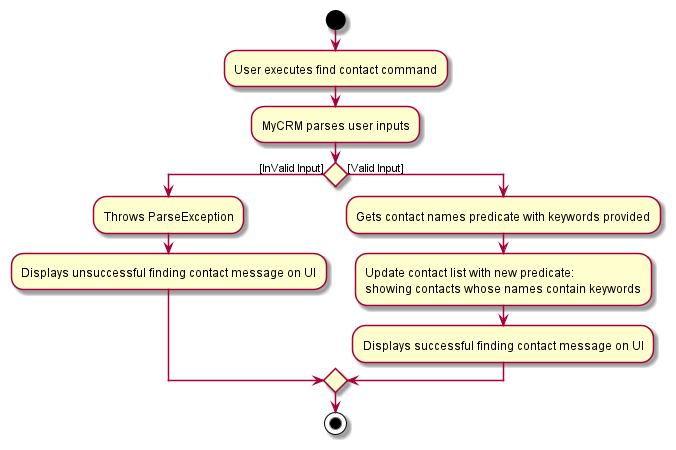](https://ay2122s1-cs2103-t14-3.github.io/tp/images/contact/FindContactActivityDiagram.png)

Given below is an example usage scenario and how the **Finding a Contact** mechanism behaves at each step.

[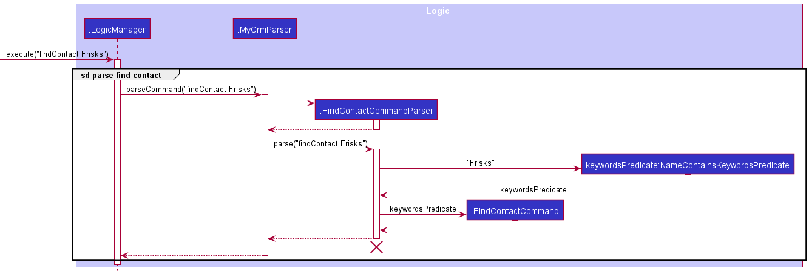](https://ay2122s1-cs2103-t14-3.github.io/tp/images/contact/FindContactParseSequenceDiagram.png)

Within `FindContactCommandParser#parse`,
- `Keywords` must be presented. (At least one trim of String)

`FindContactCommandParser#parse` will call `String#trim` and `String#split` to get list of keywords
in order for MyCRM to find corresponding contacts with these keywords as predicate.

### Hiding a Contact

#### Implementation

The **Hiding a Contact** mechanism is facilitated by the `MyCRM`. It hides a specific contact
which is visible only when user types the command `listContact -a`. Hidden contact will be tagged as `Hidden`.

#### Usage

The activity diagram below illustrates how the events of `hideContact` command behave when executed by a user:

[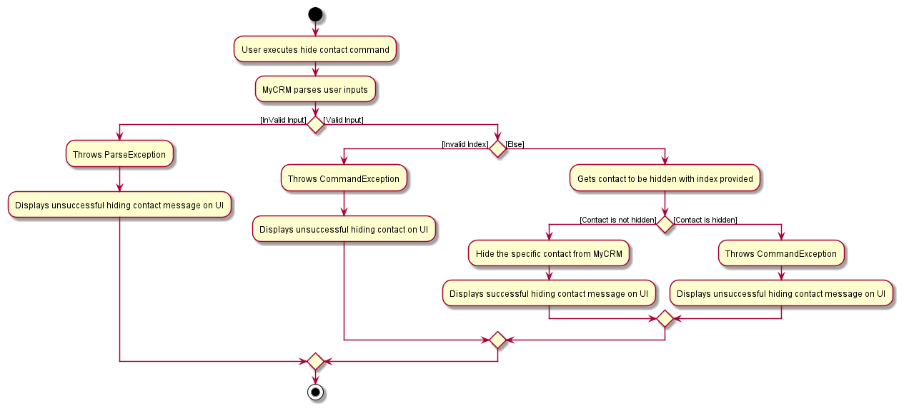](https://ay2122s1-cs2103-t14-3.github.io/tp/images/contact/HideContactActivityDiagram.png)

Given below is an example usage scenario and how the **Hiding a Contact** mechanism behaves at each step.

[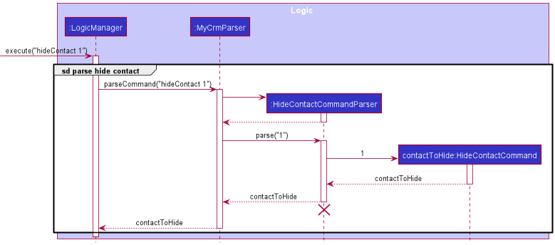](https://ay2122s1-cs2103-t14-3.github.io/tp/images/contact/HideContactParseSequenceDiagram.png)

Within `HideContactCommandParser#parse`,
- `Index` must be is valid (within the range of contactList).

`HideContactCommandParser#parse` will call `ParserUtil#parseIndex` to get the target contact's index to hide it.

[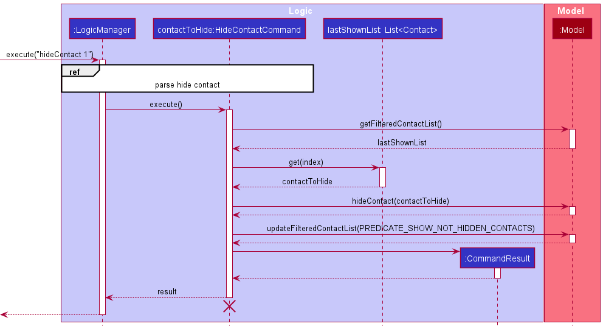](https://ay2122s1-cs2103-t14-3.github.io/tp/images/contact/HideContactSequenceDiagram.png)

### Undoing Hiding a Contact

#### Implementation

The **Undoing Hiding a Contact** mechanism is facilitated by the `MyCRM`. It will unhide a hidden contact in list. Users are
required to type in command `listContact -a` in order to see **hidden** contacts.

Implementation and usage details for **Undoing Hiding a Contact** are similar to [Hiding a Contact](#hiding-a-contact) design
pattern. Can refer to `hideContact` command implementation details.
#### Usage

The activity diagram below illustrates how the events of `undoHideContact` command behave when executed by a user:

Given below is an example usage scenario and how the **Undoing Hiding a Contact** mechanism behaves at each step.

Within `UndoHideContactCommandParser#parse`,
- `listContact -a` must first be typed in to see hidden contacts.
- `Index` must be is valid (within the range of contactList).

`UndoHideContactCommandParser#parse` will call `ParserUtil#parseIndex`

### Listing Contacts

#### Implementation

The **Listing a Contact** mechanism is facilitated by `MyCRM`. This mechanism lists all unhidden Contact
object from `UniqueContactList` inside the `MyCRM` object by default. If `listContact -a` is invoked,
`MyCRM` will list all contacts including not hidden ones.

#### Usage

The activity diagram below illustrates how the events of `listContact` command behave when executed by a user:

[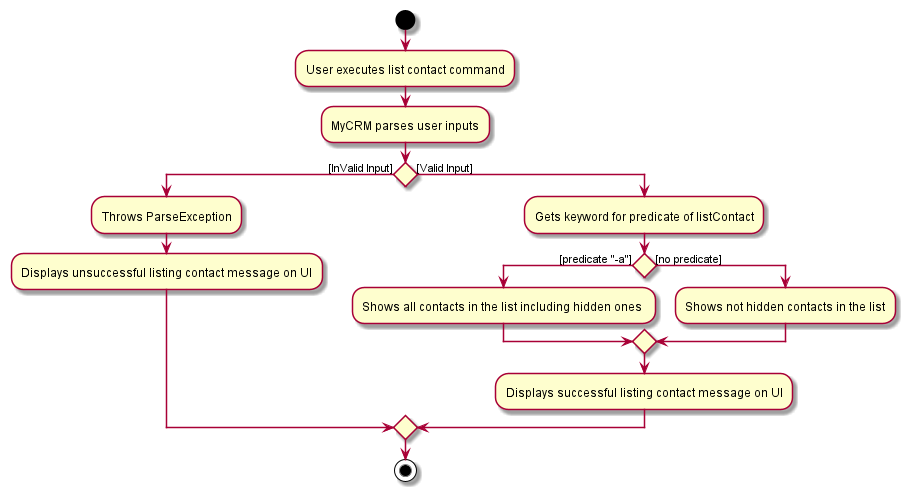](https://ay2122s1-cs2103-t14-3.github.io/tp/images/contact/ListContactActivityDiagram.png)

Given below is an example usage scenario and how the **Listing a Contact** mechanism behaves at each step.

Within `ListContactCommandParser#parse`,
- `Keywords` is optional but if provided, it can only be **"-a"**.
- If correct keyword is presented, contact list will show all contacts including hidden contacts.
If not, by default `listContact` will only show not hidden contacts in contact list.

`ListcontactCommandParser#parse` will call `String#trim` to get specific keyword.

[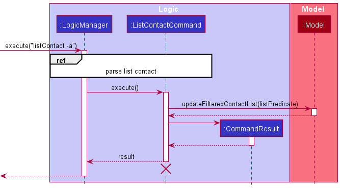](https://ay2122s1-cs2103-t14-3.github.io/tp/images/contact/ListContactSequenceDiagram.png)

### Adding a Template

#### Implementation

The **Adding a Template** mechanism is facilitated by `MyCRM`. This template created is stored internally using
`UniqueTemplateList` inside the `MyCRM` object.

#### Usage

The activity diagram below illustrates how the events of `addTemplate` command behave when executed by user:

Given below is an example usage scenario and how the Adding a Template mechanism behaves at each step.

**Parse user input**

Within `AddTemplateCommandParser#parse`, `ParserUtil#parseSubject` will be called to create a subject using
"Completed", `ParserUtil#parseBody` to create a body using "Dear customer..." and create a template using the new
subject and body.

Additionally, before adding the new template into `Model`, `Template t` will be checked if a similar copy exist
within `Model`. The conditions required is:

* If both templates have the DO NOT same `Subject` content i.e. there is an existing template with subject "Completed".

#### Design Considerations

**Aspect: Unique Template**

* Current choice: Unique by Subject
  * Pros: Easy to understand and differentiate templates
  * Cons: Does not allow for different variations of general / common email headers i.e. "Completed" subject header
    cannot be reused with different body content based on scenario
* Alternative: Unique by Subject and Body
  * Pros: Enables different variations of general / common email headers
  * Cons: May not be user-friendly as it may be hard to differentiate templates as some may be too similar at first
    glance. Such as, minor typos, copy and paste with a couple of different words. Higher risk of confusion.    

### Editing a Template

#### Implementation

The **Editing a Template** mechanism is facilitated by `MyCRM`. This mechanism reads and modifies a target template
object from `UniqueTemplateList` inside the `MyCRM` object.

#### Usage

The activity diagram below illustrates how the events of `editTemplate` command behave when executed by user:

Given below is an example usage scenario and how the Editing a Template mechanism behaves at each step.

**Parse user input**

Within `EditTemplateCommandParser#parse`,
- `Index` must be is valid (within the range of templates).
- `EditTemplateDescriptor` will only get the values of `Subject` and `Body` if their respective prefixes are present.

`EditTemplateCommandParser#parse` will call `ArgumentMultimap#getPreamble` to get the specified template index and
`ArgumentMultimap#getValue` to extract both `Subject` and `Body`: "Completed" and "Order Completed!" from the
command string respectively.

[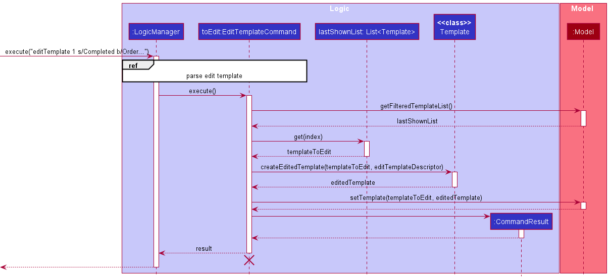](https://ay2122s1-cs2103-t14-3.github.io/tp/images/mail/EditTemplateSequenceDiagram.png)

### Deleting a Template

#### Implementation

The **Deleting a Template** mechanism is facilitated by `MyCRM`. This template removes a target template object from
`UniqueTemplateList` inside the `MyCRM` object.

#### Usage

The activity diagram below illustrates how the events of `deleteTemplate` command behave when executed by user:

Given below is an example usage scenario and how the Deleting a Template mechanism behaves at each step.

**Parse user input**

Within `DeleteTemplateCommandParser#parse`,
- `Index` must be is valid (within the range of templates) and at least one field to be edited, for the mechanism to
  execute successfully.
- `ParserUtil#parseIndex` will be called to extract the index of the specified template to delete.

[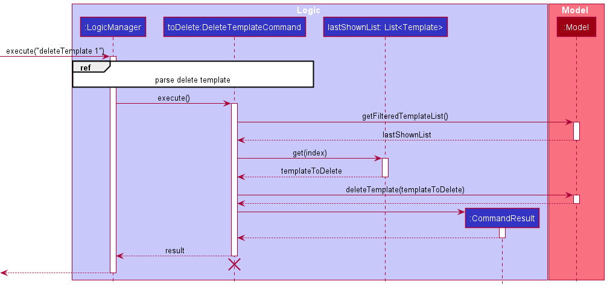](https://ay2122s1-cs2103-t14-3.github.io/tp/images/mail/DeleteTemplateSequenceDiagram.png)

### Finding a Template

#### Implementation

The **Finding a Template** mechanism is facilitated by `MyCRM`. This mechanism finds specific list of template object
from `UniqueTemplateList` inside the `MyCRM` object with certain keywords provided.

#### Usage

The activity diagram below illustrates how the events of `findTemplate` command behave when executed by a user:

[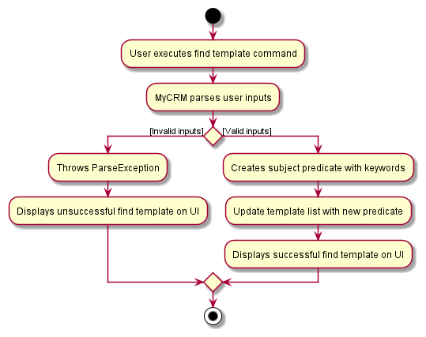](https://ay2122s1-cs2103-t14-3.github.io/tp/images/mail/FindTemplateActivityDiagram.png)

Given below is an example usage scenario and how the Finding a Template mechanism behaves at each step.

[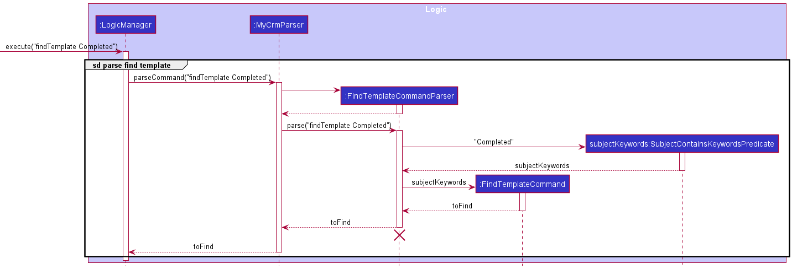](https://ay2122s1-cs2103-t14-3.github.io/tp/images/mail/FindTemplateParseSequenceDiagram.png)

**Parse user input**

Within `FindTemplateCommandParser#parse`,
-  At least one keyword must be presented.
-  Keyword specified must be whole word.

`FindTemplateCommandParser#parse` will call `String#trim` and `String#split` to get list of keywords
in order for MyCRM to find corresponding templates with these keywords as predicate.

[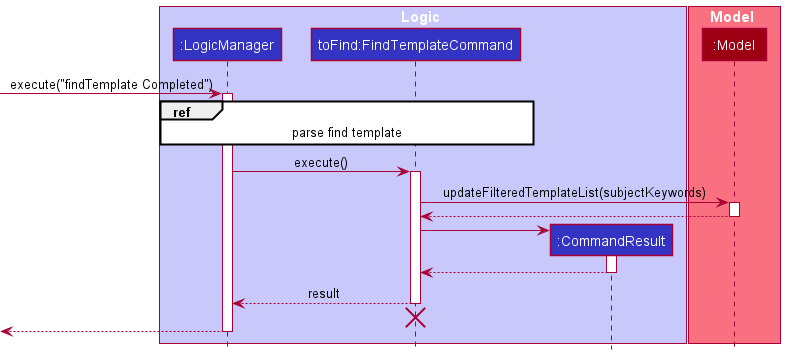](https://ay2122s1-cs2103-t14-3.github.io/tp/images/mail/FindTemplateSequenceDiagram.png)

### Constructing an Email

#### Implementation

The **Constructing an Email** mechanism is facilitated by `MyCRM`. This email is constructed based of the information
from <u>a specified job and template</u> from `UniqueJobList` and `UniqueTemplateList` inside the `MyCRM` object. <u>A
mailto URL</u> will be generated, sending users to their default mailing application with details of the job and
template.

#### Usage

The activity diagram below illustrates how the events of `mail` command behave when executed by user:

Given below is an example usage scenario and how the Constructing an Email mechanism behaves at each step.

**Parse user input**

Within `MailCommandParser#parse`,
- `JobIndex` must be is valid (within the range of job).
- `TemplateIndex` must be is valid (within the range of templates).
- `ParserUtil#parseIndex` will be called to extract both the index of the specified job and template to mail.

[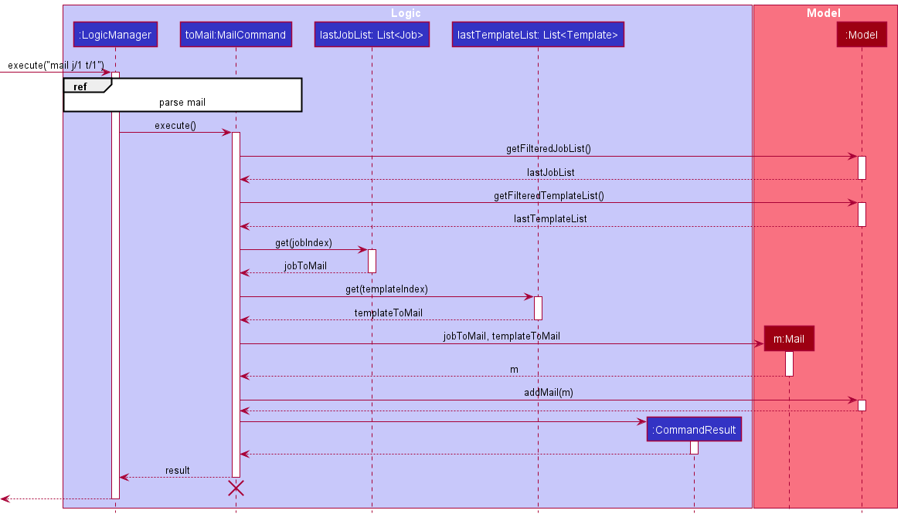](https://ay2122s1-cs2103-t14-3.github.io/tp/images/mail/MailSequenceDiagram.png)

An additional feature of constructing an email is the generation of a mailto URL, allowing for users to transfer
their job and template details to the user's default mailing application.

Given below is an example of the **generation of a mailto URL**:

After the URL is generated, the URL string is passed to a JavaFX <u>Hyperlink</u> object that when clicked, will
execute the URL path.

#### Design Considerations

**Aspect: Mailing Extension**

* Current choice: mailto URL
    * Pros: Easy to implement, is not limited to any specific email application, does not require user's email account.
    * Cons: Does not allow for direct (immediate) sending of mail to client email addresses.
* Alternative: Embedding Oauth with email service
    * Pros: Enables direct and quick sending of email directly from MyCRM application
    * Cons: Higher complexity in implementation with JavaFX, requires internet access to save drafts of emails,
      requires the storage and security assurance of user sensitive data (email account information), and limited
      management number of email accounts i.e. swapping different email services like Gmail and Outlook

### Adding a Product

#### Implementation

The **Adding a Product** mechanism is facilitated by `MyCRM`. This product created is stored internally using
`UniqueProductList` inside the `MyCRM` object.

#### Usage

The activity diagram below illustrates how the events of `addProduct` command behave when executed by user:

Given below is an example usage scenario and how the mechanism behaves at each step.

Note: Please refer to [StateManager](#statemanager) for more details on why the command result of the AddProductCommand is intercepted.

**Parse user input**

Within `AddProductCommandParser#parse`, the **factory methods** of product components (`getProductName` and
`getEmptyProductName` for product name, `getType` and `getEmptyType` for type, ...) will be invoked to create product
component objects: name, type, manufacturer, description.

**Note**: Name is *compulsory* for creating a product, whereas type, manufacturer and description are *optional* fields.

[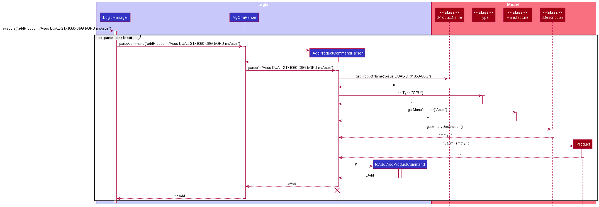](https://ay2122s1-cs2103-t14-3.github.io/tp/images/product/AddProductSequenceDiagram_Parse.png)

### Editing a Product

#### Implementation

The **Editing a Product** mechanism is facilitated by `MyCRM`. This mechanism first reads the target product object from
`UniqueProductList`, then creates a new product object with <u>user input fields</u> and <u>unchanged fields of target
product</u>. Lastly, it replaces the target product with the new one, updates its references in jobs, and updates UI.

#### Usage

The activity diagram below illustrates how the events of `editProduct` command behave when executed by user:

Given below is an example usage scenario and how the mechanism behaves at each step.

[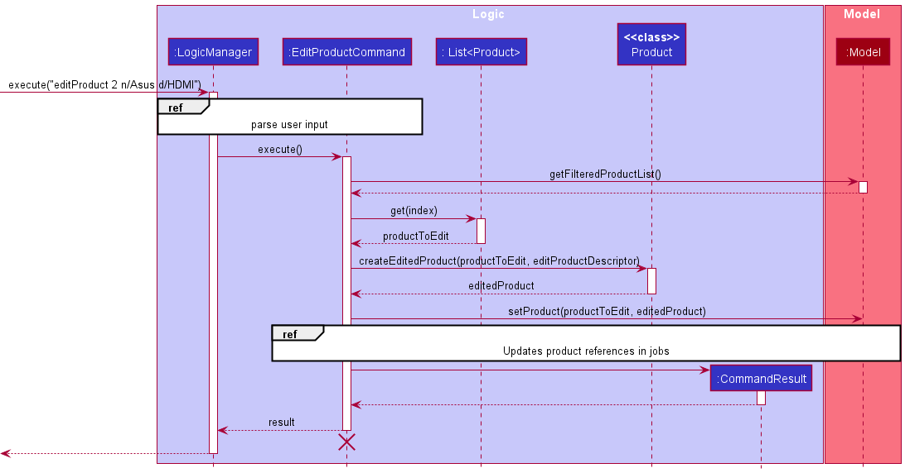](https://ay2122s1-cs2103-t14-3.github.io/tp/images/product/EditProductSequenceDiagram.png)

**Parse user input**

Within `EditProductCommandParser#parse`,
* EditProductCommandParser will only get the values of fields(`name`, `manufacturer`, `type`, `description`) if their
  respective prefixes are present.

`EditTemplateCommandParser#parse` will call `ArgumentMultimap#getPreamble` to get the specified product index and
`ArgumentMultimap#getValue` to extract product name “Asus” and description “DisplayPort, HDMI” from user input
respectively.

[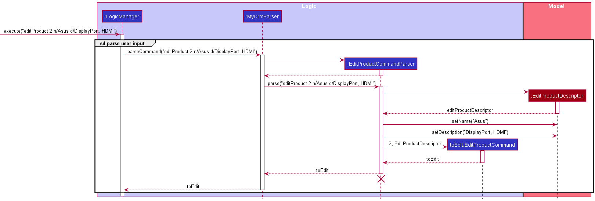](https://ay2122s1-cs2103-t14-3.github.io/tp/images/product/EditProductSequenceDiagram_Parse.png)

**Updates product references in jobs**

After target product is replaced with new product, `EditProductCommand#execute()` will traverse job list and replace
references to target product with references to new product.

To get the full job list, `EditProductCommand#execute()` will store the *lastest predicate* of job list and set the
predicate to "show all jobs". After traversing the job list and updating the references, the *latest predicate* is
restored.

<u>Design Consideration</u>: An alternative way to get full job list is to retrieve the underlying `UniqueJobList` through
`Model`. `EditProductCommand` is implemented in the other way as directly accessing and modifying `UniqueJobList` leads to an
association between `EditProductCommand` and `UniqueJobList`, which increases coupling.

### StateManager

#### Motivation

As seen from the description of the [Model Component](#model-component) the job entity holds a reference to exactly one contact and product entity.
As such, one key consideration behind job related commands was providing an easy and flexible way for users to choose to assign either
existing or new contact and/or products to jobs. As an example, when a user is adding a new job, the product or contact information needed might already exist in MyCRM,
if there have been prior repairs on the same product or if it is a repeat client. In such cases the user will want to assign an existing contact and/or product to the new job.
In other cases a new job will require creation of new contact and product entities not already present in MyCRM and subsequent assignment of these new contact and/or product entities
to the job. The goal of `StateManager` is to handle these various scenarios amd make the process of assigning contacts and products to jobs easy for the user.

#### Implementation

The description of the [Logic Component](#logic-component) describes at a high level how `StateManager` controls which commands can be executed by `LogicManager`
and how `StateManager` intercepts results of a `Command` to perform additional operations (if needed) by communicating with the `Model`.

Here is a more detailed look at how `StateManager` works:
1. Internally it has a list of possible states of the application. Based on the commands executed it remembers the current state of the application.
   e.g. If a `addJob` command is issued without a contact index, that job will not be added to `MyCRM` immediately.
   Instead, StateManager` will remember that a job is being added, and needs a contact assigned to it.
2. Each state has a corresponding list of allowed commands that are permitted in that state. It prevents `LogicManager` from executing commands not permitted for the
   current state. e.g When a contact is being assigned to a job, some commands that are allowed (non-exhaustive) are `addContact`, `listContact`, `findContact` etc...
3. When a command is executed, the state manager might intercept its `CommandResult`, to perform additional operations and update its internal state.
   e.g After an `addContact` command, `StateManager` will check the current state to see if a job is currently being added. If so state manager will link it to that job.
   If the job is complete (does not require assignment of a product), it will be added to `MyCRM` and the job creation will be complete. Otherwise, `StateManager` will update
   its internal state to remember that a job is being added, and needs a product assigned to it.
4. The `CommandResult` is modified suitably based on additional operations performed before being returned to `LogicManager`. This is so that the user is able to see
   appropriate feedback on what operations were completed.

While the above examples were in the context of `addJob` commands, `StateManager` plays a identical role in helping with the reassignment of contact and/or product for existing jobs, via the
`editJob` command.

The two activity diagrams below illustrates the events that might occur when MyCRM prompts the user to assign a contact and/or product to a job. This can happen after the user
has issued an `addJob` or `editJob` command without a contact or product index.

Notice that the user can still choose to select an existing contact and/or product even if their index wasnt provided in the `addJob` or `editJob` command itself.
This is made possible using a `select` command.

Also notice that the user can call an `abort` command to exit from the current operation.
`StateManager` will clear its state, and the adding or editing of the job will not go through.

### Adding a Job

#### Implementation

The **Adding a Job** mechanism is facilitated by `MyCRM`. Similar to other entities like products or contacts, jobs created
are stored internally using`UniqueJobList` inside the `MyCrm` object.

#### Usage

The activity diagram below illustrates the possible workflows when the `addJob` command is being executed by the user.

Notice that in the case the contact and/or product index are not provided `StateManager` will prompt for the two entities sequentially.
First it checks if the contact has been assigned, and then it checks if the product is assigned.
If only one of contact or product index is missing, `StateManager` will only ask for assignment of the missing entity.

In the [Logic Component](#logic-component) a high level sequence diagram is shown for when both the contact or product index are provided, and the job is added to MyCRM.

The below sequence diagram shows an example usage scenario where the product index is missing.
Notice how the job is passed to the `StateManager` but not added to the model, because the job does not have a product assigned.

**Parsing of user input**

As seen from the description of the [Model Component](#model-component) the job entity has many subcomponents such as `JobDescription`, `JobFee`,
`JobDate`, etc... Within `AddJobCommandParser#parse`, methods from `ParserUtil` are used to create these job subcomponents, before creating the job to be added to `MyCRM`.

### Editing a job

#### Implementation
The **Editing a Job** mechanism is facilitated by `MyCRM`. Similar to the other entities, this mechanism first reads the target job object from
`UniqueJobList`, and then creates a new job object with the <u>user input fields</u> in the `editJob` command and <u>unchanged fields of target
job</u>. Lastly, it replaces the target job with the new one and is reflected in the updated UI.

#### Usage

The activity diagram below illustrates the possible workflows when the `editJob` command is being executed by the user.

Notice one difference between the workflow between `addJob` and `editJob`. Even though the user doesn't have to provide the contact or product index in the command itself,
the user still has to indicate an intention to reassign the contact and/or product of the existing job. This is done by providing the contact or product prefixes in the command
without their index, e.g `editJob INDEX c/ p/`

The below sequence diagram shows an example usage scenario where both the contact and product indexes are present.

The parsing for `editJob` is similar to `addJob` where methods from `ParserUtil` are used to create the sub-components,
before creating the edited version of the job.

### Printing a monthly job report

#### Implementation

The **Printing a monthly job report** mechanism is facilitated by `MyCRM`. This job report is generated based of the information from
<u>jobs completed in this month</u> and <u> received in this month</u> from `UniqueJobList` inside `MyCRM` object. A report window
will be created with details of completed jobs, in-progress jobs, top three popular products, and a bar graph showing monthly revenue.

#### Usage

The activity diagram below illustrates how the events of `printReport` command behave when executed by user:

Given below is an example usage scenario and how the mechanism behaves at each step.

Within `PrintReportCommandParser#parse`,
- `CommandFlag` is optional but if provided, it can only be either **"-i"** or **"-p"**.
- If **"-i"** is presented, report window will show all in-progress jobs received in this month.
- If **"-i"** is presented, report window will show the top three popular products in this month. 
- if no flag is presented, report windwo will shou all jobs completed in this month by default.

`PrintReportCommandParser#parse` will call `String#trim` to get specific command flag.

--------------------------------------------------------------------------------------------------------------------

## **Documentation, logging, testing, configuration, dev-ops**

* [Documentation guide](Documentation.md)
* [Testing guide](Testing.md)
* [Logging guide](Logging.md)
* [Configuration guide](Configuration.md)
* [DevOps guide](DevOps.md)

--------------------------------------------------------------------------------------------------------------------

## **Appendix: Requirements**

### Product scope

**Target user profile**:

* is a tech-savvy computer repair shop technician.
* owns a business repairing computers and laptops, actively servicing multiple clients and answering their queries.
* has a need to manage a wide range of models and deals with both hardware and software issues.
* has multiple repair-phases which have to be updated to clients.
* prefer desktop apps over other types
* can type fast
* prefers typing to mouse interactions
* is reasonably comfortable using CLI apps

**Value proposition**:

* manages clients and jobs faster than a typical mouse/GUI driven app
* centralizes jobs and client information
* integrates both status tracking and client notification/mailing
* automates monthly reports and statistics generation

### User stories

Priorities: High (must have) - `* * *`, Medium (nice to have) - `* *`, Low (unlikely to have) - `*`

| Priority | As a …​             | I want to …​                                           | So that I can…​                                                    |
| -------- | ---------------------- | --------------------------------------------------------- | --------------------------------------------------------------------- |
| `*`      | potential user         | see the app populated with sample data                    | easily see how the app will look like when it is in use               |
| `*`      | user ready to start    | purge all current data                                    | Get rid of sample data and begin tinkering / exploring the app        |
| `* *`    | new user               | view a guide                                              | familiarize with the text-input commands                              |
| `* * *`  | user                   | send out emails                                           | easily notify clients that their repair job has been completed        |
| `* * *`  | user                   | create new jobs                                           | begin tracking a new repair job                                       |
| `* * *`  | user                   | edit existing jobs                                        | amend details pertaining to a job                                     |
| `* * *`  | user                   | create new contacts                                       | notify a client of his/her job status (like completion, etc.)         |
| `* * *`  | user                   | edit existing contacts                                    | change information about a client                                     |
| `* * *`  | user                   | link an existing contact to a job                         | reuse the contact information of a returning client for a new job     |
| `* * *`  | user                   | create new products                                       | refer to the relevant details of how to repair a specific device      |
| `* * *`  | user                   | edit existing products                                    | change repair details or method about a product                       |
| `* * *`  | user                   | link an existing product to a job                         | reuse the product information of  a previous for a new job            |
| `* * *`  | user                   | search for jobs using job status, service tag, client name or product name | find the jobs that match the specification           |
| `* *`    | regular user           | print out monthly job records and statistics              | learn about the month’s performance and analyze how to improve        |
| `* *`    | regular user           | print out next month’s scheduled / on-going job           | plan ahead resources for the coming month                             |
| `*`      | regular user           | hide unused job fields                                    | not be distracted by empty / irrelevant fields.                       |
| `*`      | regular user           | hide unused contacts                                      | not be distracted by irrelevant clients.                              |
| `*`      | regular user           | customize the app’s user interface (like font and colour) | make the interface look more stylish and pleasant for the eyes        |
| `* *`    | regular user           | export my monthly records and statistics                  | store my record externally for future reference                       |

### Use cases

(For all use cases below, the **System** is the `MyCRM` and the **Actor** is the `user`, unless specified otherwise)

**Use case: UC01 - Adding a repair job**

**MSS**

1. User provides details to add a repair job.
2. MyCRM creates a new repair job with the provided job description and associates a repair job with
   a product and contact.

   Use case ends.

**Extensions**

* 1a. User does not provide all the necessary details needed for the creation of a job.

    * 1a1. MyCRM shows an error message and requests for the missing details.
    * 1a2. User enters the missing details.

      Steps 1a1-1a2 are repeated until the user enters the details. Use case resumes at step 2.

**Use case: UC02 - Editing a repair job**

**MSS**

1. User requests to edit a repair job.
2. MyCRM shows the list of repair jobs.
3. User selects a repair job from the list.
4. User provides details about fields they want to update.
5. MyCRM updates the fields of the repair job with the information provided.

   Use case ends.

**Extensions**

* 2a. The list of repair jobs is empty.

  Use case ends.

* 3a. User selects invalid repair job not in the list.

    * 3a1. MyCRM shows an error message and asks user to re-select a repair job.
    * 3a2. User re-selects a repair job.

      Steps 3a1-3a2 are repeated until the user selects a valid repair job. Use case resumes at step 4.

* 4a. The given fields provided by the User are invalid.

    * 4a1. MyCRM shows an error message and asks user for the details they want to update again.
    * 4a2. User provides the details they want to update.

      Steps 4a1-4a2 are repeated until the user provided valid details. Use case resumes at step 5.

**Use case: UC03 - Deleting a repair job**

**MSS**

1. User requests to delete a repair job.
2. MyCRM shows a list of repair jobs.
3. User selects a repair job from the list which they want to delete.
4. MyCRM deletes the repair job.

   Use case ends.

**Extensions**

* 2a. The list is empty.

  Use case ends.

* 3a. User selects invalid repair job not in the list.

    * 3a1. MyCRM shows an error message and asks user to re-select a repair job.
    * 3a2. User re-selects a repair job they want to delete.

      Steps 3a1-3a2 are repeated until the user selects a valid repair job. Use case resumes at step 4.

**Use case: UC04 - Mark a repair job as completed**

**MSS**

1. User requests to mark a repair job as completed.
2. MyCRM shows a list of repair jobs.
3. User selects a repair job from the list which they want to mark as completed.
4. MyCRM marks the repair job as complete, and hides the repair job from the job list.

   Use case ends.

**Extensions**

* 2a. The list is empty.

  Use case ends.

* 3a. User selects invalid repair job not in the list.

    * 3a1. MyCRM shows an error message and asks user to re-select a repair job.
    * 3a2. User re-selects a repair job they want to hide.

      Steps 3a1-3a2 are repeated until the user selects a valid repair job. Use case resumes at step 4.

* 3b. User selects a job that is already marked as completed.
    * 3b1. MyCRM shows an error message telling the user the job has
      already been marked as completed.

    Use case ends.

**Use case: UC05 - List repair jobs**

**MSS**

1. User requests to list all repair jobs.
2. MyCRM shows a list of repair jobs.

   Use case ends.

**Extensions**

* 2a. The list is empty.

  Use case ends.

**Use case: UC06 - Find a repair job**

**MSS**

1. User wants to find a repair job and provides keywords they want to search by.
2. MyCRM shows a list of filtered repair jobs for which the keywords
   appear in the job's description, contact or product.

   Use case ends.

**Extensions**

* 2a. No repair job matches any of the keywords provided by the user.

  Use case ends.

**Use case: UC07 - Adding a client contact**

**MSS**

1. User requests to add a contact with specific info of name, contact number, address, and email.
2. MyCRM stores the new contact in the contact list.

    Use case ends.

**Extensions**

* 1a. The given contact name is empty.

  * 1a1. MyCRM shows an error message.  

    Use case resumes at step 1.

* 1b. Either the given contact number, address or email is empty.

  * 1b1. MyCRM shows an error message.  

    Use case resumes at step 1.

* 1c. The given contact name already exists.

  * 1c1. MyCRM shows an error message.  

    Use case resumes at step 1.

**Use case: UC08 - Editing a client contact**

**MSS**

1. User requests to edit a contact.
2. MyCRM shows a list of contacts.
3. User requests to edit a specific contact's info with specific index and type of the field in contact.
4. MyCRM updates this specific contact's info.

    Use case ends.

**Extensions**

* 2a. The list is empty.

  Use case ends.

* 3a. The given index is invalid.

    * 3a1. MyCRM shows an error message.

      Use case resumes at step 2.

* 3b. The given edit field type is invalid.

    * 3b1. MyCRM shows an error message.

      Use case resumes at step 2.

**Use case: UC09 - Deleting a client contact**

**MSS**

1. User requests to delete a contact.
2. MyCRM shows a list of contacts.
3. User requests to delete a specific contact
4. MyCRM deletes the contact.

    Use case ends.

**Extensions**

* 2a. The list is empty.

  Use case ends.

* 3a. The given index is invalid.

    * 3a1. MyCRM shows an error message.

      Use case resumes at step 2.

**Use case: UC10 - Hiding a client contact**

**MSS**

1. User requests to hide a contact.
2. MyCRM shows a list of contacts.
3. User requests to hide a specific contact in the list.
4. MyCRM tags the contact as hidden.

    Use case ends.

**Extensions**

* 2a. The list is empty.

  Use case ends.

* 3a. The given index is invalid.

    * 3a1. MyCRM shows an error message.

      Use case resumes at step 2.

**Use case: UC11 - Undo hiding a client contact**

**MSS**

1. User requests to undo hiding a hidden contact.
2. MyCRM shows a list of contacts.
3. User requests to undo hiding the specific contact in the list.
4. MyCRM undo the hidden tag for this contact.

   Use case ends.

**Extensions**

* 2a. The list is empty.

  Use case ends.

* 3a. The given index is invalid.

    * 3a1. MyCRM shows an error message.

      Use case resumes at step 2.

**Use case: UC12 - Sending an email**

**Precondition:** Operating system has a default email application

**MSS**

1. User requests to send an email.
2. MyCRM shows a list of jobs.
3. User requests to email a specific job in the list.
4. MyCRM shows a list of email templates.
5. User requests to copy a specific email template.
6. MyCRM generates mailto link of the job and template

    Use case ends.

**Extensions**

* 2a. The list of jobs is empty.

  Use case ends.

* 3a. The given index is invalid.

    * 3a1. MyCRM shows an error message.

      Use case resumes at step 2.

* 3b. The job at given index does not have an email.

    * 3a1. MyCRM shows an error message.

      Use case resumes at step 2.

* 4a. The list of templates is empty.

  Use case ends.

* 5a. The given index is invalid.

    * 3a1. MyCRM shows an error message.

      Use case resumes at step 4.

**Use case: UC13 - Adding an email template**

**MSS**

1. User requests to add an email template with specific subject and body.
2. MyCRM creates email template.

   Use case ends.

**Extensions**

* 1a. The given subject is empty.

    * 1a1. MyCRM shows an error message.

      Use case resumes at step 1.

* 1b. The given subject is invalid format.

    * 1b1. MyCRM shows an error message.

      Use case resumes at step 1.

* 1c. The given body is empty.

    * 1c1. MyCRM shows an error message.

      Use case resumes at step 1.

**Use case: UC14 - Listing all email template**

**MSS**

1. User requests to view all email template.
2. MyCRM shows a list of email template.

   Use case ends.

**Use case: UC15 - Listing all email template**

**MSS**

1. User request to find a template of specified subject keyword(s).
2. MyCRM shows a list of filtered template for which the keywords appear in the template's subject.
   product.

   Use case ends.

**Use case: UC16 - Editing an email template**

**MSS**

1. User request to edit an email template.
2. MyCRM shows a list of email template.
3. User requests to edit a specific template's subject or body (or both) in the list.
4. MyCRM modifies the template with new subject or body (or both).

   Use case ends.

**Extensions**

* 2a. The list is empty.

  Use case ends.

* 3a. The given index is invalid.

    * 3a1. MyCRM shows an error message.

      Use case resumes at step 2.

* 3b. The given subject is empty

    * 3b1. MyCRM shows an error message.

      Use case resumes at step 2.

* 3c. The given subject is invalid format.

    * 3c1. MyCRM shows an error message.

      Use case resumes at step 2.

* 3d. The given body is empty.

    * 3d1. MyCRM shows an error message.

      Use case resumes at step 2.

**Use case: UC17 - Deleting an email template**

**MSS**

1. User requests to delete an email template.
2. MyCRM shows a list of email template.
3. User requests to delete a specific template in the list.
4. MyCRM shows deletes the template.

   Use case ends.

**Extensions**

* 2a. The list is empty.

  Use case ends.

* 3a. The given index is invalid.

    * 3a1. MyCRM shows an error message.

      Use case resumes at step 2.

**Use case: UC18 - Finding an email template**

**MSS**

1. User wants to find an email template job and provides keywords they want to search by.
2. MyCRM shows a list of filtered templates for which the keywords appear in the template's subject.

   Use case ends.

**Use case: UC19 - Viewing user guide**

**MSS**

1. User requests to view the user guide.
2. MyCRM shows a popup with the GitHub user guide URL.

   Use case ends.

**Use case: UC20 - Exiting the program**

**Postcondition:** MyCRM application closes.

**MSS**

1. User requests to exit MyCRM.
2. MyCRM shows a goodbye message.

   Use case ends.

**Use case: UC21 - Clearing MyCRM data**

**Postcondition:** MyCRM data of contacts, products, and templates are empty.

**MSS**

1. User request to clear data.
2. MyCRM removes data from job, contact, product list.

   Use case ends.

**Use case: UC22 - Add Product**

**MSS**

1. User requests to add a new product.
2. MyCRM creates a new product and shows a message with info of the product.

    Use case ends.

**Extensions**

* 2a. The product name already exists.
    * MyCRM shows an error message.

    Use case ends.

* 2b. The product name is empty.
    * MyCRM shows an error message.

    Use case ends.

**Use case: UC23 - List Products**

**MSS**

1. User requests to view the list of products.
2. MyCRM shows the list of products.

   Use case ends.

**Extensions**
* 2a. The list of products is empty.

  Use case ends.

**Use case: UC24: Delete a product**

**MSS**

1. User requests to delete a specific product in the list.
2. MyCRM deletes the product.

    Use case ends.

**Extensions**

* 1a. The given index is invalid.
    * 1a1. MyCRM shows an error message.

    Use case ends.    

* 1b. The specified product is linked to one or more jobs.
    * 1b1. MyCRM shows an error message.

    Use case ends.

**Use case: UC25: Edit a product.**

**MSS**

1. User requests to edit a specific product in the list.
2. MyCRM edits the product and shows a success message with info of edited product.

   Use case ends.

**Extensions**

* 1a. The given index is invalid.
    * 1a1. MyCRM shows an error message.

    Use case ends.

* 1b. User requests to edit the name of the product.
    * 1b1. The product name already exists
    * 1b2. MyCRM shows an error message.

    Use case ends.

* 1c. All fields that user provides are empty.
    * 1c1. MyCRM shows an error message.

    Use case ends.

**Use case: UC26 - Retrieve Previous Command**

**MSS**

1. User requests to retrieve previously entered command.
2. MyCRM shows the previous command.

   Use case ends.

**Extensions**
* 2a. MyCRM show the most recent command.

   Use case ends.

* 2b. MyCRM list all history commands.

   Use case ends.

**Use case: UC27 - Change the theme of user interface(UI)**

**MSS**

1. User requests to change the theme of UI.
2. MyCRM changes the theme of Ui.

    Use case ends.

**Extensions**
* 1a. User enters a theme name that does not exist in MyCRM.
    * 1a1. MyCRM shows an error message.

    Use case ends.

* 1b. User enters the name of current theme.
    * 1a1. MyCRM keeps the current theme.

  Use case ends.

**Use case: UC28 - Print out monthly job records and statistics**

**MSS**

1. User requests to print out monthly job report.
2. MyCRM shows the monthly job report in a new window.

   Use case ends.

**Extensions**
* 1a. User requests to print out monthly job report when report window is not shown.
    * 1a1. MyCRM shows the report window.

  Use case ends.

* 1b. User requests to print out monthly job report when report window is shown.
    * 1b1. MyCRM focuses on the report window.

  Use case ends.

**Use case: UC29 - Export monthly job records and statistics**

**MSS**

1. User requests to export monthly job report.
2. MyCRM show the page setup dialog and print dialog.

### Non-Functional Requirements

1. Should work on any _mainstream OS_ as long as it has Java `11` or above installed.
2. Should be able to hold up to 100 _entries_ without a noticeable sluggishness in performance for typical usage.
3. Should be designed for a single-user.
4. Should work without an internet connection.
5. Should be accessible via the downloaded JAR file without any other installations needed.
6. Should take up less than 50 MB computer storage.
7. Should work on both 32-bit and 64-bit environments.
8. A user with above average typing speed for regular English text (i.e. not code, not system admin commands)
   should be able to accomplish most of the tasks faster using commands than using the mouse.

### Glossary

* **Mainstream OS**: Windows, Linux, Unix, OS-X.
* **Private contact detail**: A contact detail that is not meant to be shared with others.
* **Repair Job**: A customer request to restore machinery, equipment, or other products to working order.
* **Job Status**: A progress bar showing the customer's job's degree of completion.
* **JSON**: Javascript Standard Object Notation, which is a form of syntax used for storing data.
* **mailto**: A Uniform Resource Identifier scheme for email addresses, produces hyperlinks on websites that allow
  users to send an email.
* **URL**: A Uniform Resource Locators is a unique identifier commonly used to access a resource on the Internet.
* **Entry**: Contact/job/product.

--------------------------------------------------------------------------------------------------------------------

## **Appendix: Instructions for manual testing**

Given below are instructions to test the app manually.

:information_source: **Note:** These instructions only provide a starting point for testers to work on;
testers are expected to do more *exploratory* testing.

### Launch

1. Initial launch

   1. Download the jar file and copy into an empty folder

   2. Double-click the jar file.
       Expected: Shows the GUI with a set of sample contacts, products, templates and job. The window size may
      not be optimum.

2. Saving window preferences

   1. Resize the window to an optimum size. Move the window to a different location. Close the window.

   2. Re-launch the app by double-clicking the jar file.
       Expected: The most recent window size and location is retained.

1. Saving theme preferences

    1. [Choose a theme](UserGuide.md#changing-the-theme-of-user-interface-theme) of GUI. Close the window.

    1. Re-launch the app by double-clicking the jar file. 
       Expected: The most recent theme is retained.

### Shutdown

1. Exiting application

    1. Test case: `exit`
        Expected: GUI closes and application is shutdown.

    2. Test case: Click the exit 'x' (cross)
        Expected: Similar to previous

### Requesting help

1. Opening help page

    1. Test case: `help`
        Expected: Shows the help GUI with user guide details.

    2. Test case: Press F1
        Expected: Similar to previous

    3. Test case: Click "Help" > "Help F1"
        Expected: Similar to previous

### Adding contact

1. Inserting a contact while all contacts are being shown.

   1. Prerequisites: List contacts using the `listContact` command. Shows list of contacts in side panel.

   2. Test case: `addContact n/Jack Ryan c/94678954 a/Blk 65 Tampines Ave 1 e/jryan@gmail.com`
       Expected:
      - New contact is added to the list.
      - Details of contact shown in status message.

   3. Test case: `addContact n/Sans c/85230240 a/Clementi Ave 1 e/Sans@gmail.com`
       Expected:
      - New contact is added to the list.
      - Details of contact shown in status message.

   4. Test case: `addContact n/Jack Ryan c/94678954 a/Blk 65 Tampines Ave 1 e/jryan@gmail.com`
       Expected:
       - No new contact is added
       - Command error for duplicate contact is shown in status message.

   5. Test case: `addContact n/Jay`
       Expected:
       - Similar to previous.
       - Command error for at least one field of phone, email and address required is shown in status message.

   6. Test case: `addContact n/Jay&sda c/83336233`
       Expected:
       - Similar to previous.
       - Command error for name format details is shown in status message.   

   7. Test case: `addContact n/Jay c/abcd`
       Expected:
       - Similar to previous.
       - Command error for phone format details is shown in status message.

   8. Test case: `addContact n/Jay e/abcd`
       Expected:
       - Similar to previous.
       - Command error for email format details is shown in status message.

   9. Test case: `addContact n/Jay a/`
       Expected:
       - Similar to previous.
       - Command error for address format details is shown in status message.    

2. Inserting a contact while all contacts are NOT being shown.

    1. Prerequisites: List other data types i.e. `listTemplate` command. Shows list of other data in side panel.

    2. Correct test cases similar to (1)
        Expected:
        - Similar to (1)
        - Side panel will list all contacts.

    3. Other incorrect test cases similar to (1)
        Expected:
        - Similar to (1)
        - Side panel remains at current list. No new contacts are added.

### Editing a contact

1. Editing a contact while all contacts are being shown.

    1. Prerequisites: List contacts using the `listContact` command. Shows list of contacts in side panel.

    2. Test case: `editContact 1 n/Jacky e/Jacky@gmail.com`
        Expected:
        - Contact index 1 is updated in the list.
        - Details of contact shown in status message.

    3. Test case: `editContact 2 n/Jacky`
        Expected:
        - No contact is edited.
        - Command error for duplicate contact is shown in status message.

    4. Test case: `editContact 1`
         Expected:
         - Similar to previous.
         - Command error for at least one field of name, phone, email, address or tag required is shown in status message.

    5. Test case: `editContact 1 n/Jay&sda`
        Expected:
        - Similar to previous.
        - Command error for name format details is shown in status message.

    6. Test case: `editContact 1 c/abcd`
        Expected:
        - Similar to previous.
        - Command error for phone format details is shown in status message.

    7. Test case: `editContact 1 e/abcd`
        Expected:
        - Similar to previous.
        - Command error for email format details is shown in status message.

    8. Test case: `editContact 1 a/`
        Expected:
        - Similar to previous.
        - Command error for address format details is shown in status message.

2. Editing a contact while all contacts are NOT being shown.

    1. Prerequisites: List other data types i.e. `listTemplate` command. Shows list of other data in side panel.

    2. Correct test cases similar to (1)
        Expected:
        - Similar to (1)
        - Side panel will list all contacts.

    3. Other incorrect test cases similar to (1)
        Expected:
        - Similar to (1)
        - Side panel remains at current list. No new contacts are edited.

### Deleting a contact

1. Deleting a contact while all contacts are being shown.

    1. Prerequisites: List contacts using the `listContact` command. Shows list of contacts in side panel.

    2. Prerequisites: No contacts are linked to a job.

    3. Test case: `deleteContact 1`
        Expected:
        - Contact index 1 is deleted in the list.
        - Details of contact shown in status message.

    4. Test case: `deleteContact -1`
         Expected:
         - Similar to previous.
         - Command error for invalid index is shown in status message.

2. Deleting a contact while all contacts are being shown.

    1. Prerequisites: List contacts using the `listContact` command. Shows list of contacts in side panel.

    2. Prerequisites: All contacts are linked to a job.

    3. Test case: `deleteContact 1`
        Expected:
        - No contacts are deleted.
        - Command error for invalid contact deletion requirement is shown in status message.

    4. Test case: `deleteContact -1`
         Expected:
         - Similar to previous.
         - Command error for invalid index is shown in status message.

3. Deleting a contact while all contacts are NOT being shown.

    1. Prerequisites: List other data types i.e. `listTemplate` command. Shows list of other data in side panel.

    2. Prerequisites: No contacts are linked to a job.

    3. Correct test cases similar to (1)
        Expected:
        - Similar to (1)
        - Side panel will list updated contact list.

    4. Other incorrect test cases similar to (1)
        Expected:
        - Similar to (1)
        - Side panel remains at current list. No contacts are deleted.

### Finding contacts

1. Finding contacts while all contacts are being shown.

    1. Prerequisites: List contacts using the `listContact` command. Shows list of contacts in side panel.

    2. Test case: `findContact Jacky`
         Expected:
         - Matching contacts are shown on list.
         - Number of contacts found shown in status message.

    3. Test case: `findContact abcd`
        Expected:
        - No matching contacts are shown on list.
        - Zero contacts found shown in status message.

2. Finding contacts while all contacts are NOT being shown.

    1. Prerequisites: List other data types i.e. `listTemplate` command. Shows list of other data in side panel.

    2. Test cases similar to (1)
        Expected:
        - Similar to (1)
        - Side panel will list matching all contacts.

### Hiding contacts

1. Hiding a contact while all contacts are being shown.

    1. Prerequisites: List contacts using the `listContact` command. Shows unhidden list of contacts in side panel.

    2. Test case: `hideContact 1`
        Expected:
        - Contact 1 is hidden on list.
        - Side panel will update list of all not hidden contacts.

    3. Test case: `hideContact -1`
        Expected:
        - No contact is hidden on list.
        - Side panel will remain the current contact list.

2. Hiding a contact while all contacts are NOT being shown.

    1. Prerequisites: List other data types i.e. `listTemplate` command. Shows list of other data in side panel.

    2. Correct test cases similar to (1)
        Expected:
        - Similar to (1)
        - Side panel will update contact list.

    3. Incorrect test cases similar to (1)
        Expected:
        - Similar to (1)
        - Side panel will remain current contact list.

### Undoing hiding contacts

1. Undo hiding a contact while all contacts are being shown.

    1. Prerequisites: List contacts using the `listContact -a` command. Shows unhidden list of contacts in side panel.

    2. Test case: `undoHideContact 1`
        Expected:
        - Contact 1 is hidden on list.
        - Side panel will update list of all not hidden contacts.

    3. Test case: `undoHideContact -1`
        Expected:
        - No contact is hidden on list.
        - Side panel will remain the current contact list.

### Listing contacts

1. Test case: `listContact`
    Expected:
    - Side panel will list all not hidden contacts.

2. Test case: `listContact -a`
    Expected:
    - Side panel will list all contacts.

3. Test case: `listContact abcd`
    Expected:
    - Side panel will remain current list.
    - Command error for invalid listContact format is shown in status message.

### Constructing mail

1. Constructing a mail when there is at least one job and mail.

    1. Prerequisites: There must be at least one job and mail in MyCRM. `addJob`, `addTemplate`

    2. Test case: `mail j/1 t/1`
        Expected:
        - New mail is added to MyCRM with first job and template.
        - Details of mail shown in status message.
        - Details of mail shown in main panel with mailtoURL.

    3. Test case: `mail j/1`
        Expected:
        - No mail is constructed.
        - Format error details is shown in status message.

    4. Test case: `mail t/1`
        Expected:
        - Similar to previous

    5. Test case: `mail j/0 t/0`
        Expected:
        - Similar to previous
        - Index error details is shown in status message.

    6. Test case: `mail j/1 t/-1`
        Expected:
        - Similar to previous

### Adding template

1. Inserting a template while all templates are being shown.

   1. Prerequisites: List all templates using the `listTemplate` command. Shows list of templates in side panel.

   2. Test case: `addTemplate s/ANewTemplate b/This is a new template!`
        Expected:
       - New template is added to the list.
       - Details of template shown in status message.

   3. Test case: `addTemplate s/A New Template b/This is a new template!\nRegards`
        Expected:
       - Similar to previous
       - New template body will represent '\n' as a newline.

   4. Test case: `addTemplate s/Completed b/Your order has been completed`
        Expected:
       - No template is added.
       - Duplicate error details is shown in status message.

   5. Test case: `addTemplate s/!Inv@lid b/Your order has been completed`
        Expected:
       - Similar to previous
       - Subject error details is shown in status message.

   6. Test case: `addTemplate s/Valid subject b/`
        Expected:
       - Similar to previous
       - Body error details is shown in status message.

2. Inserting a template while all templates are NOT being shown.

   1. Prerequisites: List other data types i.e. `listProduct` command. Shows list of other data in side panel.

   2. Correct test cases similar to (1)
       Expected:
       - Similar to (1)
       - Side panel will list all templates.

   3. Other incorrect test cases similar to (1)
       Expected:
       - Similar to (1)
       - Side panel will NOT list all templates. Remains at current list.

### Editing template

1. Editing a template while all templates are being shown.

   1. Prerequisites: List all templates using the `listTemplate` command. Shows list of templates in side panel.

   2. Test case: `editTemplate 1 s/New Completed`
       Expected:
       - First template is updated to the list.
       - Details of template shown in status message.

   3. Test case: `editTemplate 1 b/New Body`
       Expected:
      - Similar to previous.

   4. Test case: `editTemplate 1 s/Brand New Completed b/Brand New Body`
       Expected:
       - Similar to previous.

   5. Test case: `editTemplate 1 s/!Inv@lid`
       Expected:
       - No template is edited.
       - Subject error details is shown in status message.

   6. Test case: `editTemplate 1 b/   `
       Expected:
       - Similar to previous
       - Body error details is shown in status message.

   7. Test case: `editTemplate 0 s/3rd New Completed b/3rd New Body`
       Expected:
       - Similar to previous
       - Format error details is shown in status message.

2. Editing a template while all templates are not shown.

    1. Prerequisites: List other data types i.e. `listProduct` command. Shows list of other data in side panel.

    2. Correct test cases similar to (1)
       Expected:
        - Similar to (1)
        - Side panel will list all templates.

    3. Other incorrect test cases similar to (1)
        Expected:
       - Similar to (1)
       - Side panel will NOT list all templates. Remains at current list.

### Deleting template

1. Deleting a template while all templates are being shown.

    1. Prerequisites: List all templates using the `listTemplate` command. Shows list of templates in side panel.

    2. Test case: `deleteTemplate 1`
        Expected:
        - First template is deleted to the list.
        - Details of template shown in status message.

    3. Test case: `deleteTemplate 0`
        Expected:
        - Similar to previous
        - Format error details is shown in status message.

2. Deleting a template while all templates are not shown.

    1. Prerequisites: List other data types i.e. `listProduct` command. Shows list of other data in side panel.

    2. Correct test cases similar to (1)
        Expected:
        - Similar to (1)
        - Side panel will list all templates.

    3. Other incorrect test cases similar to (1)
        Expected:
        - Similar to (1)
        - Side panel will NOT list all templates. Remains at current list.

### Finding template

1. Finding a template while all templates are being shown.

    1. Prerequisites: List all templates using the `listTemplate` command. Shows list of templates in side panel.

    2. Test case: `findTemplate Done`
        Expected:
        - Matching templates are shown on list.
        - Number of template found shown in status message.

    3. Test case: `findTemplate Done New Template`
        Expected:
        - Similar to previous

   3. Test case: `findTemplate $`
       Expected:
       - No matching templates are shown on list.
       - Zero templates found shown in status message.

2. Finding a template while all templates are not shown.

    1. Prerequisites: List other data types i.e. `listProduct` command. Shows list of other data in side panel.

    2. Test cases similar to (1)
        Expected:
        - Similar to (1)
        - Side panel will list all templates.

### Saving data

1. Dealing with missing data files

    1. To simulate a missing file, delete the myCrm.json file from the data directory.
    2. Re-launch the app by double-clicking the jar file.
        Expected: The application will generate a new myCrm.json with sample data.

2. Dealing with corrupted data files

    1. To simulate a corrupted file, open the myCrm.json file from data directory.
    2. Delete line 2 from the file.
    3. Re-launch the app by double-clicking the jar file.
        Expected: The application will not load any data, empty content.

3. Customising with JSON data file

    1. Test case: Customising contact
        1. Open the myCrm.json file from data directory.
        2. Modify first contact name i.e.'Damith Rajapakse'
        3. Re-launch the app by double-clicking the jar file.
            Expected: The application will load data, first contact name is modified.

    2. Test case: Customising template
        1. Similar to previous
        2. Modify first subject i.e.'Welcome newcomer'
            Expected: The application will load data, first subject is modified.

    3. Test case: Customising product
        1. Similar to previous
        2. Modify first product type i.e.'Computer Unit'
            Expected: The application will load data, first product type is modified.

    4. Test case: Customising job
        1. Similar to previous
        2. Modify first job fee i.e.'$100.00'
            Expected: The application will load data, first job fee is modified.

    5. Other correct test cases: Customising contact, template, product, job
        1. Similar to adding correct contact, template, product, job test case
            Expected: The application will load data, data is modified.

    6. Other incorrect test cases: Customising contact, template, product, job
        1. Similar to adding incorrect contact, template, product, job test case
            Expected: The application will not load any data, empty content.

### Adding product

1. Inserting a product while all products are being shown

    1. Prerequisites: List all products using the `listProduct` command. Shows list of products in side panel.

    2. Test case: `addProduct n/new product one t/GPU m/Asus`
      Expected:
       - New product is added to the list.
       - Details of product shown in status message.  

    3. Test case: `addProduct n/new product two`
         Expected:
        - Similar to previous.

    4. Test case: `addProduct n/ t/CPU m/Intel`
         Expected:
        - No product is added.
        - Format error details is show in status message.  

   5. Test case: `addProduct n/duplicate_product_name t/Motherboard m/Asus`
        Expected:
       - No product is added.
       - Duplicate error details is shown in status message.

2. Inserting a product while all products are NOT being shown.

    1. Prerequisites: List other data types i.e. `listTemplate` command. Shows list of other data in side panel.

    2. Correct test cases similar to (1)
        Expected:
        - Similar to (1)
        - Side panel will list all products.

    3. Other incorrect test cases similar to (1)
        Expected:
        - Similar to (1)
        - Side panel will NOT list all products. Remains at current list.

### Editing product

1. Editing a product while all products are being shown

    1. Prerequisites: List all products using the `listProduct` command. Shows list of products in side panel.

    2. Test case: `editProduct 2 d/Video output interface: DisplayPort, HDMI`
         Expected:
        - Second product is updated to the list.
        - Details of product shown in status message.

    3. Test case: `editProduct 2 m/GIGABYTE`
         Expected:
        - Similar to previous.

    4. Test case: `editProduct 2 n/duplicate product name`
         Expected:
        - No product is edited.
        - Duplicate error details is shown in status message.

    5. Test case: `editProduct 0 m/GIGABYTE`
         Expected:
        - No product is edited.
        - Format error details is show in status message.  

2. Editing a product while all products are NOT being shown.

    1. Prerequisites: List other data types i.e. `listTemplate` command. Shows list of other data in side panel.

    2. Correct test cases similar to (1)
        Expected:
        - Similar to (1)
        - Side panel will list all products.

    3. Other incorrect test cases similar to (1)
        Expected:
        - Similar to (1)
        - Side panel will NOT list all products. Remains at current list.

### Editing product

1. Editing a product while all products are being shown

    1. Prerequisites: List all products using the `listProduct` command. Shows list of products in side panel.

    2. Test case: `editProduct 2 d/Video output interface: DisplayPort, HDMI`
         Expected:
        - Second product is updated to the list.
        - Details of product shown in status message.

    3. Test case: `editProduct 2 m/GIGABYTE`
         Expected:
        - Similar to previous.

    4. Test case: `editProduct 2 n/duplicate product name`
         Expected:
        - No product is edited.
        - Duplicate error details is shown in status message.

    5. Test case: `editProduct 0 m/GIGABYTE`
         Expected:
        - No product is edited.
        - Format error details is show in status message.

2. Editing a product while all products are NOT being shown.

    1. Prerequisites: List other data types i.e. `listTemplate` command. Shows list of other data in side panel.

    2. Correct test cases similar to (1)
        Expected:
        - Similar to (1)
        - Side panel will list all products.

    3. Other incorrect test cases similar to (1)
        Expected:
        - Similar to (1)
        - Side panel will NOT list all products. Remains at current list.

### Deleting Product

1. Deleting a product while all products are being shown.

    1. Prerequisites: List all products using the `listProduct` command. Shows list of products in side panel.

    2. Test case: `deleteProduct 1`
        Expected:
        - First product is deleted to the list.
        - Details of product shown in status message.

    3. Test case: `deleteProduct 0`
        Expected:
        - No product is deleted.
        - Format error details is shown in status message.

2. Deleting a product while all products are not shown.

    1. Prerequisites: List other data types i.e. `listTemplate` command. Shows list of other data in side panel.

    2. Correct test cases similar to (1)
        Expected:
        - Similar to (1)
        - Side panel will list all products.

    3. Other incorrect test cases similar to (1)
        Expected:
        - Similar to (1)
        - Side panel will NOT list all products. Remains at current list.

### Finding product

1. Finding a product while all products are being shown.

    1. Prerequisites: List all products using the `listProduct` command. Shows list of products in side panel.

    2. Test case: `findProduct Asus`
        Expected:
        - Matching products are shown on list.
        - Number of product found shown in status message.

    3. Test case: `findProduct Asus gpu`
        Expected:
        - Similar to previous

    3. Test case: `findProduct @`
        Expected:
        - No matching products are shown on list.
        - Zero products found shown in status message.

2. Finding a product while all products are not shown.

    1. Prerequisites: List other data types i.e. `listTemplate` command. Shows list of other data in side panel.

    2. Test cases similar to (1)
        Expected:
        - Similar to (1)
        - Side panel will list all products.

### Adding job

1. Inserting a new job while all in-progress jobs are being shown.

   1. Prerequisites: List all in-progress jobs using the `listJob` command. Shows list of in-progress jobs in the main panel.
      At least 1 contact and product must be present for below test cases.

   3. Test case: `addJob d/CPU replacement needed fee/$30.00 recv/08/11/2021 by/03/01/2022 c/1 p/1`
       Expected:
       - New job is added to the job list. Job should be linked to first contact displayed currently in the 
         contact list and first product currently displayed in the product list.
       - Details of job added shown in status message.

   4. Test case: `addJob d/CPU fix needed fee/$30.00 by/03/01/2022 c/1 p/1`
       Expected:
       - New job is added to the job list. Job should be linked to first contact currently displayed in the
         contact list and first product currently displayed in the product list.
       - Details of job added shown in status message.
       - Since received date wasn't provided it should be automatically set to the current date.

   5. Test case: `addJob d/CPU fix needed fee/$30.00 by/03/01/2022 c/1 p/1`
       Expected:
       - No new job is added (provided the previous test case was run first)
       - Error for duplicate job is shown in status message.

   6. Test case: `addJob d/CPU replacement fee/$30.00`
       Expected:
       - No new job is added
       - Invalid command format error shown 

   7. Test case: `addJob d/CPU replacement by/03/01/2021`
       Expected:
       - No new job is added
       - Invalid command format error shown

   8. Test case: `addJob fee/$30.00 by/03/01/2022`
       Expected:
       - No new job is added
       - Invalid command format error shown

   9. Test case: 
      Input these 3 commands one after another:
      - `addJob d/Upgrade CPU fee/$100.00 by/05/01/2022`
      - `select 1`
      - `select 1`
       Expected:
      - New job is added to the job list. Job should be linked to first contact currently displayed in the
        contact list and first product currently displayed in the product list.
      - Details of job added shown in status message.
      
2. Inserting a job while all completed jobs are being shown.

   1. Prerequisites: List all completed jobs using the `listJob -c` command. Shows list of completed jobs in the main panel.

   2. Test Case : `addJob d/CPU not working fee/$30.00 recv/08/11/2021 by/03/01/2022 c/1 p/1`
       Expected:
      - Main panel will switch to show all in-progress jobs.
      - New in-progress job is added to the job list. Job should be linked to first contact currently displayed in the
        contact list and first product currently displayed in the product list.
      - Details of job added shown in status message

### Editing a job

1. Editing an in-progress job.

   1. Prerequisites: List all in-progress jobs using the `listJob` command. Shows list of in-progress jobs in the main panel.
      Must have at least 1 in-progress job in the list for below test cases to work.

   2. Test case: `editJob 1 fee/$1000.00`
       Expected:
       - Job at index 1 in the currently displayed job list, should have its fee updated accordingly.
       - Details of job edited shown in status message.

   3. Test case: `editJob 1 d/CPU Slow`
       Expected:
       - Job at index 1 in the currently displayed job list, should have its description updated accordingly.
       - Details of job edited shown in status message.

   4. Test case: `editJob 1`
       Expected:
       - Job at index 1 in the currently displayed job list, should not be edited.
       - Error shown saying at least one field to edit must be provided.

2. Editing a completed job

   1. Prerequisites: List all completed jobs using the `listJob -c` command. Shows list of completed jobs in the main panel.
      Must have at least 1 completed job in the list for below test cases to work.

   2. Test case: `editJob 1 d/Completed repair for CPU`
       Expected:
      - Job at index 1 in the currently displayed job list, should have its description updated accordingly.
      - Details of job edited shown in status message.
      
### Deleting a job

1. Deleting an in-progress job

   1. Prerequisites: List all in-progress jobs using the `listJob` command. Shows list of in-progress jobs in the main panel.
      Must have at least 1 in-progress job in the list for below test cases to work.

   2. Test case: `deleteJob 1`
       Expected:
       - Job at index 1 in the currently displayed job list is deleted.
       - Details of deleted job shown in status message.

   3. Test case: `deleteJob -1`
       Expected:
       - No jobs are deleted.
       - Invalid command format error shown.

2. Deleting a completed job.

   1. Prerequisites: List all completed jobs using the `listJob -c` command. Shows list of completed jobs in the main panel.
      Must have at least 1 completed job in the list for below test cases to work.
  
   2. Test case: `deleteJob 1`
       Expected:
       - Job at index 1 in the currently displayed job list is deleted.
       - Details of deleted job shown in status message.
       - Job list should continue to show list of all completed jobs. (Or an empty list if the only completed job was deleted)
       
### Finding jobs

1. Finding jobs

  2. Test case: `findJob CPU`
      Expected:
    - Matching jobs (both in-progress and completed) are shown on list.
    - Number of jobs found shown in status message.

### Marking job as complete

1. Marking an in-progress job as complete.

   1. Prerequisites: Prerequisites: List all in-progress jobs using the `listJob` command. Shows list of in-progress jobs in the main panel.
      Must have at least 1 in-progress job in the list for below test cases to work.

   2. Test case: `completeJob 1 10/01/2022`
       Expected:
       - Job at index 1 in the currently displayed job list will be marked as complete, and will disappear from the current job
         list displaying all in-progress jobs.
       - Details of completed job shown in status message.

2. Marking a completed job as complete.

   1. Prerequisites: List all completed jobs using the `listJob -c` command. Shows list of completed jobs in the main panel.
      Must have at least 1 completed job in the list for below test cases to work.

   2. Test case: `completeJob 1`
       Expected:
     - Job at index 1 in the currently displayed job list remains unchanged.
     - Error message informing user that the job has already been completed is shown.

### Revert completion status of a previously complete job

1. Revert completion status of an in-progress job.

   1. Prerequisites: Prerequisites: List all in-progress jobs using the `listJob` command. Shows list of in-progress jobs in the main panel.
      Must have at least 1 in-progress job in the list for below test cases to work.

   2. Test case: `undoCompleteJob 1`
       Expected:
       - Job at index 1 in the currently displayed job list remains unchanged.
       - Error message informing user that the job has not been completed yet is shown.

2. Revert completion status of a completed job.

   1. Prerequisites: List all completed jobs using the `listJob -c` command. Shows list of completed jobs in the main panel.
      Must have at least 1 completed job in the list for below test cases to work.

   2. Test case: `undoCompleteJob 1`
       Expected:
      - Completion status of Job at index 1 in the currently displayed job list reverted.
      - Details of job whose completion status was reverted is shown.

### Listing jobs

1. Test case: `listJob`
    Expected:
  - Main panel will list all in-progress jobs.

2. Test case: `listJob -a`
    Expected:
  - Main panel will list all jobs (completed and in-progress).

3. Test case: `listJob -c`
    Expected:
  - Main panel will list all completed jobs.

### Retrieving history command
    
1. Retrieving all history commands in a list.

    1. Test case: `history`
         Expected:
        - All previously entered commands are shown in side panel.

2. Retrieving the most recent history command.

    1. Prerequisites: At least two commands are entered i.e. `listProduct`, `anything`, etc.
    
    2. Test case: "Press up arrow key"
         Expected:
        - The most recent history command will appear in command box.
    
    3. Test case: "Press up arrow key twice"
         Expected:
        - The command before the last one will appear in command box.
    
    4. Test case: "Press up arrow key twice and then press down arrow key"
         Expected:
        - The last entered command will appear in command box.

### Printing out monthly job report

1. Printing out monthly job report while report window is not shown.

    1. Prerequisites: At least one contact is added to MyCRM 
        i.e. `addContact n/Sans c/83921823 e/Sans@gmail.com a/Maxwell Chambers 32 Maxwell Rd`
        two jobs are added to MyCRM 
        i.e. `addJob d/Change CPU fee/$50 by/10/11/2021 c/1 p/2`, `addJob d/Change GPU fee/$55 by/11/11/2021 c/1 p/1`
        and two products are added to MyCRM.
        i.e. `addProduct n/Asus DUAL-GTX1060-O6G t/GPU m/Asus`, `addProduct n/Intel i5-10400F t/CPU m/Intel d/2.90GHz`
        Then marking one job as completed
        i.e. `completeJob 1`
       
    2. Test case: `printReport`
         Expected:
        - The report window will pop up.
        - The report window will show the monthly completed jobs in a list and a bar graph indicating the monthly revenue for last four months of this year and last year. 
    
    3. Test case: `printReport -i`
         Expected；
        - The report window will pop up.
        - The report window will show the incompleted jobs received in this month and a bar graph similar to last test case.
    
    4. Test case: `printReport -p`
         Expected:
        - The report window will pop up.
        - The report window will show the top three popular product received in this month and a bar graph similar to last test case.

2. Printing out monthly job report while report window is shown but minimized.

    1.Prerequisites: Similar to (1) but minimize the report window.

    2. Test case similar to (1)
         Expected:
        - Similar to (1)
        - The report window is focused.

### Exporting monthly job report

1. Exporting monthly job report while report window is opened.

    1. Prerequisites: Open report window i.e. `printReport`.
    
    2. Test case: "Click on the Print button"
         Expected:
        - MyCRM will show a page setup page and print page (on WindowsOS).
        - MyCRM will show a print page (on MacOS).
    
2. Exporting monthly job report while report window is not opened.

    1. Prerequisites: Not open report window beforehand.

    1. Test case: `exportReport`
         Expected:
        - Similar to (1),

:information_source: **Note:** *Print* button might not always work for MacOS users.

